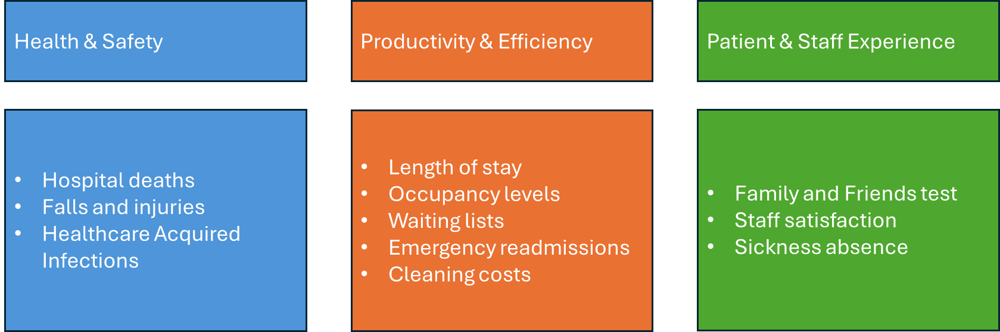

``` {r setup}
library(dplyr)
library(ggplot2)
library(targets)
library(lubridate)

```

# Introduction, approach and summary

## Introduction

::: columns
::: {.column width="50%"}
Since it's inception, the New Hospital Programme (NHP) has advocated for single bed rooms (SBR). The grounds for this are based on a range of guidance, evidence and previous policy statements of intent. Whilst that position is unequivocal, there is uncertainty around the quantification of impacts of such a change and thus the assumptions that feed into demand and capacity models and economic business cases for current and future new hospital developments.
:::

::: {.column width="50%"}
Specifically, a starting assumption was that a length of stay reduction of 12% was likely for all new SBR facilities compared to prior trends. This assumption was criticised by the national audit office (NAO) (Office 2023) in the face of a mixed evidence base.

It is the express aim of this analysis therefore to quantify the range of likely impacts for length of stay and a basket of other measures across patient & staff experience, productivity and health & safety.
:::
:::

## Approach

::: columns
::: {.column width="50%"}
-   Previous literature reviews and general searches were undertaken to identify potential impact factors.

-   Identified relevant measures or proxy measures from publicly available data and routine data sources.

-   Included only those with sufficient time series and of acceptable data quality into final impact framework.

-   Cleansed and compiled all the data into time series format.
:::

::: {.column width="50%"}
-   Identified 'control' sites and providers to compare to our natural experiment sites.

-   Several stages of this matching according to hospital function, size, case-mix and admission ratio's.

-   Performed causal impact analysis on the pre and post intervention periods to detect the nature and scale of impacts for each natural experiment.

-   Aggregated findings for the non-specialist hospitals.
:::

:::

## Summary of key findings

Regardless of direction of impact, our results are not consistent across hospital sites. This suggests that there are a number of other factors in the hospital design, systems, policies and procedures that are important. Switching to single bedroom hospitals without considering the other factors would not necessarily have a positive effect on outcomes nor mitigate any likely risks. This inconsistency is reflective of the findings from published literature.

# The impact framework

## Overview



# The hospitals

## 7 natural experiments

::: {.columns}
::: {.column}
-   Royal Liverpool (Oct 2022)
-   Clatterbridge Cancer Centre (June 2020)
-   Royal Papworth Hospital (May 2019)
-   Chase Farm Hospital (Sept 2018)
-   Southmead Hospital (May 2014)
-   Tunbridge Wells (Jan/Sept 2011)
-   Peterborough Hospital (Nov 2010)
:::

::: {.column}

:::

:::

# Summary of methods

## Selecting control sites

::: {.columns}
::: {.column}
Before including control sites into the calculation of the post-intervention counterfactual, we must ensure they're similar to the site under study. We do this in several consecutive steps:

1.    Filter on similar site types e.g. General Acute, Tertiary Centre
2.    Exclude those with dissimilar single bed %'s at the point of intervention
3.    Match on (the closest 20) according to the following variables:

-   Hospital size (m2)
-   Patient case-mix (median age)
-   Elective:Non-elective spell ratio
:::

::: {.column}

:::

:::

## Causal Impact Analysis


## Aggregating impacts


# Main results
